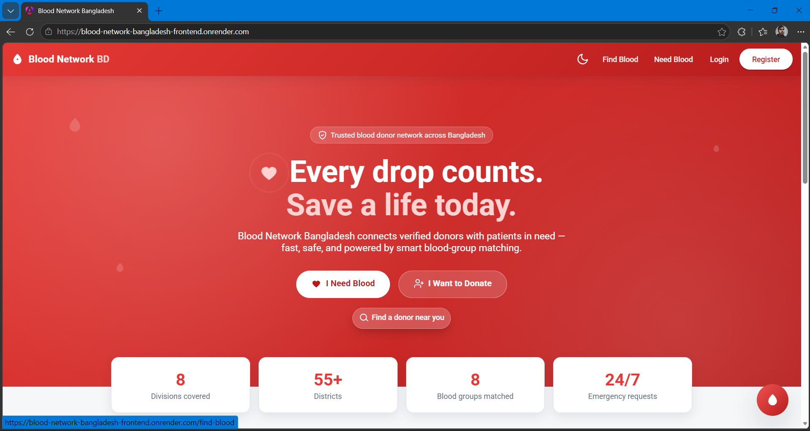
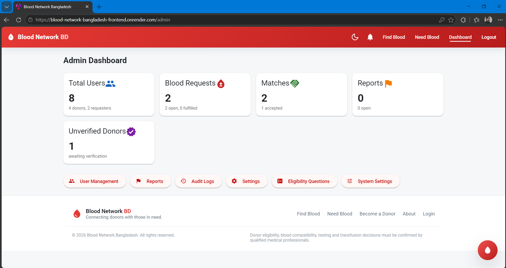
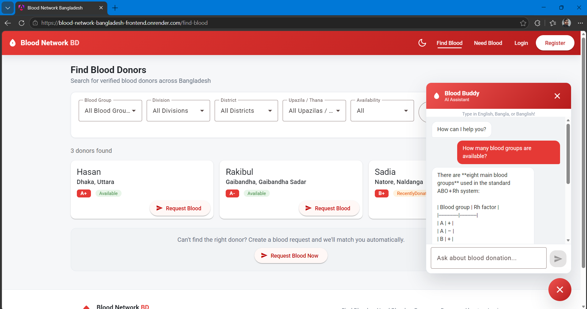

# Blood Network Bangladesh

<p align="center">
  <strong>Connecting blood donors with those in need — quickly, safely, and reliably.</strong>
</p>

## Screenshots

| Homepage | Admin Dashboard | AI Chat |
|---|---|---|
|  |  |  |

---

## Why This Project Exists

In Bangladesh, finding a blood donor during a medical emergency is one of the most stressful and time-critical challenges families face. The existing solutions — static directories, Facebook groups, word-of-mouth — suffer from a fundamental problem: **outdated information**.

A donor listed in a directory may have:
- Changed their phone number
- Moved to a different city
- Donated recently and is temporarily ineligible
- Become unreachable or inactive

When someone is bleeding out after an accident, or a thalassemia patient needs an emergency transfusion, **stale data can cost lives**.

**Blood Network Bangladesh** was built to solve this specific problem: *not just listing donors, but finding **currently available, eligible, and reachable** donors as fast as possible.*

The platform answers one critical question:

> **"Which suitable donors are likely to be available and reachable right now?"**

---

## The Problem We're Solving

| Problem | Our Approach |
|---|---|
| Outdated donor directories | Real-time availability status that donors control |
| No way to know if a donor recently donated | Configurable donation interval tracking |
| Hard to find nearby donors | Location-based matching with distance scoring |
| Fake or spam requests | Rate limiting, abuse reporting, admin verification |
| No verification of donors | Multi-level verification system (phone, profile, blood group) |
- Privacy concerns | Donor contact info hidden by default; revealed only after consent |
| Coordination chaos | Structured request → match → accept/decline → fulfill workflow |

---

## Key Features

### Emergency Blood Request
Anyone can create an emergency blood request in under a minute. The system immediately searches for compatible, available donors nearby and ranks them by eligibility, proximity, and availability.

### Smart Donor Matching (Admin-Tunable)
The matching engine considers:
- **Blood compatibility** (ABO/Rh rules)
- **Donor availability** (self-declared status)
- **Donation interval** (`MinimumDonationIntervalDays` — admin-editable)
- **Verification status** (Verified/Unverified/Rejected)
- **Profile freshness** (`DonorProfileConfirmationDays` — admin-editable)
- **Geographic proximity** (distance buckets 0-3/3-10/10-25/>25 km — each weight admin-editable)

All weights are **not hard-coded**: admins tune them live via `Admin → System Settings` (`PUT /api/admin/system-settings`), backed by `SystemSettings` DB row with `appsettings.json` seed fallback.

### Donor Empowerment
Donors control their own availability. They can:
- Set themselves as Available, Unavailable, or let the system auto-set RecentlyDonated
- Update their profile and confirm freshness
- Accept or decline blood requests
- Track their donation history

### Privacy by Design
- Exact donor addresses are never publicly exposed
- Phone numbers are not publicly searchable
- GPS coordinates are kept private
- Contact information is revealed only after appropriate consent

### Admin Dashboard
Administrators can:
- Verify donor profiles
- Manage users (activate, deactivate, block)
- Review and resolve abuse reports
- Monitor platform activity and statistics
- View audit logs for all sensitive actions

---

## Technology Stack

| Layer | Technology |
|---|---|
| **Frontend (Web)** | Angular 21, TypeScript, Angular Material, SCSS |
| **Frontend (Mobile)** | Android (Kotlin, Jetpack Compose, Material 3, Retrofit, Coroutines) |
| **Backend** | ASP.NET Core 10, C#, Clean Architecture |
| **Database** | PostgreSQL with Entity Framework Core |
| **Authentication** | JWT (access + refresh tokens), role-based authorization |
| **API Documentation** | Swagger / OpenAPI |
| **Logging** | Serilog (console + file) |
| **Architecture** | Clean Architecture (Domain → Application → Infrastructure → API) |

---

## Project Structure

```
Blood-Network-Bangladesh/
├── src/
│   ├── BloodNetwork.Api/              # ASP.NET Core Web API
│   ├── BloodNetwork.Application/      # Business logic, DTOs, validators, services
│   ├── BloodNetwork.Domain/           # Entities (User, DonorProfile, SystemSettings...), enums
│   └── BloodNetwork.Infrastructure/   # EF Core, PostgreSQL, auth, providers
├── frontend/
│   └── blood-network-web/             # Angular 21 web app (Admin: System Settings, User Mgmt)
├── android/ Blood Network Bangladesh Android App/
│   └── app/src/main/java/...          # Kotlin/Compose mobile app (mirrors web admin)
├── tests/
│   ├── BloodNetwork.UnitTests/        # Matching, validation, service tests
│   └── BloodNetwork.IntegrationTests/ # Auth, request, push tests
├── docs/
│   ├── architecture.md
│   ├── feedback.md
│   ├── memory.md
│   └── status.md
└── blood_network_bangladesh_prd.md
```

---

## Clean Architecture

The backend follows Clean Architecture principles:

```
┌─────────────────────────────────┐
│           API Layer             │  Controllers, middleware, DI
├─────────────────────────────────┤
│        Application Layer        │  Commands, queries, DTOs, validators
├─────────────────────────────────┤
│          Domain Layer           │  Entities, enums, domain rules (no dependencies)
├─────────────────────────────────┤
│      Infrastructure Layer       │  EF Core, PostgreSQL, auth, external services
└─────────────────────────────────┘
```

**Dependencies point inward only.** The Domain layer has zero external dependencies.

---

## API Endpoints

### Authentication
- `POST /api/auth/register` — Register new user
- `POST /api/auth/login` — Login with phone + password
- `POST /api/auth/verify-phone` — Verify phone number
- `POST /api/auth/refresh` — Refresh JWT token

### Donors
- `GET /api/donors` — Search donors (filtered)
- `GET /api/donors/me` — Get own profile
- `PUT /api/donors/me` — Update profile
- `PATCH /api/donors/me/availability` — Toggle availability
- `GET /api/donors/nearby` — Find nearby donors

### Blood Requests
- `POST /api/blood-requests` — Create emergency request
- `GET /api/blood-requests` — List requests
- `GET /api/blood-requests/{id}` — Get request details
- `POST /api/blood-requests/{id}/cancel` — Cancel request
- `POST /api/blood-requests/{id}/fulfill` — Mark fulfilled

### Matches
- `GET /api/blood-requests/{id}/matches` — View matched donors
- `POST /api/matches/{id}/accept` — Donor accepts request
- `POST /api/matches/{id}/decline` — Donor declines request

### Admin
- `GET /api/admin/dashboard` — Platform statistics (Unverified donors = awaiting verification, not stale Pending)
- `GET /api/admin/users` — User management (filters: role, active, verification)
- `PUT /api/admin/users/{id}/status` — Activate/deactivate user
- `POST /api/admin/users/{id}/verify` — Verify donor (Verified/Rejected/Unverified; Pending removed as dead state)
- `GET /api/admin/system-settings` — Get dynamic business rules & match weights
- `PUT /api/admin/system-settings` — Update weights & rules (applies immediately, no redeploy)

Full API documentation available at `/swagger` when running in development mode.

---

## Getting Started

### Prerequisites
- [.NET 10 SDK](https://dotnet.microsoft.com/download/dotnet/10.0)
- [Node.js 20+](https://nodejs.org/)
- [PostgreSQL](https://www.postgresql.org/download/)
- [Angular CLI](https://angular.dev/cli) (`npm install -g @angular/cli`)

### Backend Setup

```bash
# Clone the repository
git clone https://github.com/InfinityAbir/Blood-Network-Bangladesh.git
cd Blood-Network-Bangladesh

# Update connection string in src/BloodNetwork.Api/appsettings.json
# Default: Host=localhost;Port=5432;Database=blood_network;Username=postgres;Password=postgres

# Build the solution
dotnet build BloodNetwork.slnx

# Run the API
cd src/BloodNetwork.Api
dotnet run
```

API will be available at `https://localhost:5001` (or `http://localhost:5000`).

### Frontend Setup

```bash
cd frontend/blood-network-web

# Install dependencies
npm install

# Start development server
ng serve
```

Angular will be available at `http://localhost:4200`.

---

## Configurable Settings (Dynamic, Admin-Editable)

All business rules are **admin-editable at runtime** via `Admin → System Settings` (no redeploy needed). Values are stored in the `SystemSettings` table with `appsettings.json` as fallback seed.

```json
// GET /api/admin/system-settings  |  PUT /api/admin/system-settings  (Admin only)
{
  "minimumDonationIntervalDays": 90,        // RecentlyDonated window
  "donorProfileConfirmationDays": 90,       // Unknown after this many days
  "maxActiveRequestsPerUser": 3,
  "contactCooldownHours": 24,
  "exactBloodGroupWeight": 30,              // +30 for exact match
  "compatibleBloodGroupWeight": 0,
  "availableWeight": 30,
  "unknownWeight": 0,
  "verifiedWeight": 15,
  "unverifiedWeight": 0,
  "profileFreshnessWeight": 10,
  "distance0to3kmWeight": 15,
  "distance3to10kmWeight": 10,
  "distance10to25kmWeight": 5,
  "distanceOver25kmWeight": 0
}
```

> **Before:** weights lived only in `appsettings.json:AppSettings:MatchScoreWeights` (required redeploy to tune).  
> **Now:** `ISystemSettingsService` backs `MatchingService`, `DonorService`, `BloodRequestService` etc. with DB values; `PUT /api/admin/system-settings` updates immediately for new matches. Legacy `IOptions<MatchScoreWeightsOptions>` remains as seed fallback if DB row missing.

---

## Blood Compatibility

The platform uses standard ABO/Rh red-blood-cell compatibility for donor matching:

| Donor | Can Donate To |
|---|---|
| O- | Everyone (universal donor) |
| O+ | A+, B+, AB+, O+ |
| A- | A-, A+, AB-, AB+ |
| A+ | A+, AB+ |
| B- | B-, B+, AB-, AB+ |
| B+ | B+, AB+ |
| AB- | AB-, AB+ |
| AB+ | AB+ only |

> **Important:** This is a logistical matching aid, not medical advice. Final donor eligibility and transfusion decisions must be made by qualified medical professionals.

---

## Development Phases

| Phase | Status | Description |
|---|---|---|
| A: Foundation | ✅ Complete | Solution structure, Clean Architecture, EF Core, Angular + Android scaffold, CI |
| B: Identity | ✅ Complete | Registration, JWT (access+refresh), phone validation, role-based guards (Donor/Requester/Admin) |
| C: Donors | ✅ Complete | Donor profiles, Bangladesh location hierarchy, availability (Available/RecentlyDonated/Unknown), verification (Unverified/Verified/Rejected — Pending removed as dead state), photo upload |
| D: Blood Requests | ✅ Complete | Emergency request CRUD, validation, status (Open/PartiallyFulfilled/Fulfilled/Cancelled), cooldown & max-active enforcement (dynamic) |
| E: Matching Engine | ✅ Complete | ABO/Rh compatibility, distance (Haversine), eligibility, configurable scoring — weights now **admin-editable via SystemSettings** without redeploy |
| F: Notifications | ✅ Complete | In-app + SignalR + FCM push, bulk admin alerts, unread badges |
| G: Admin | ✅ Complete | Dashboard (Unverified donors count fixed), user management with verification filters, reports, audit logs, eligibility questions, **System Settings** (match weights & business rules) |
| H: Security & Quality | ✅ Complete | Rate limiting, FluentValidation, global exception handling, audit logs, 47 unit + integration tests, privacy review |
| I: Deployment | ✅ Complete | Render (API + DB PostgreSQL), env-based config, HTTPS, Swagger, health checks, FCM |
| J: Mobile App | ✅ Complete | Android (Kotlin/Compose, Material 3, Retrofit) mirrors web: donor search, request flow, admin, system settings |
| K: Dynamic Config | ✅ Complete | `SystemSettings` entity + `ISystemSettingsService` + `PUT /api/admin/system-settings`; web & Android admin UIs for live tuning |
| L: Cleanup | ✅ Complete | Removed dead states from UI/logic (`Pending` chip, `Volunteer` role); enums kept as `[Obsolete]` for DB compat, data migrated via `20260831165402_CleanupVolunteerPending` (`Volunteer`→`Requester`, `Pending`→`Unverified`), fully removable when needed |

---

## Safety & Disclaimers

This platform:

- **Does NOT** sell blood or encourage unsafe donation
- **Does NOT** diagnose users or guarantee medical eligibility
- **Does NOT** replace qualified medical professionals
- **Does NOT** publish exact donor addresses or NID information

All donor eligibility, blood compatibility testing, and transfusion decisions must be confirmed by qualified medical professionals or the relevant blood collection service.

---

## Contributing

1. Fork the repository
2. Create a feature branch (`git checkout -b feature/amazing-feature`)
3. Commit your changes (`git commit -m 'feat: add amazing feature'`)
4. Push to the branch (`git push origin feature/amazing-feature`)
5. Open a Pull Request

---

## License

This project is open source and available for non-commercial use.

---

## Acknowledgments

Built with the goal of saving lives by connecting those who need blood with those who can give it — faster than ever before.
